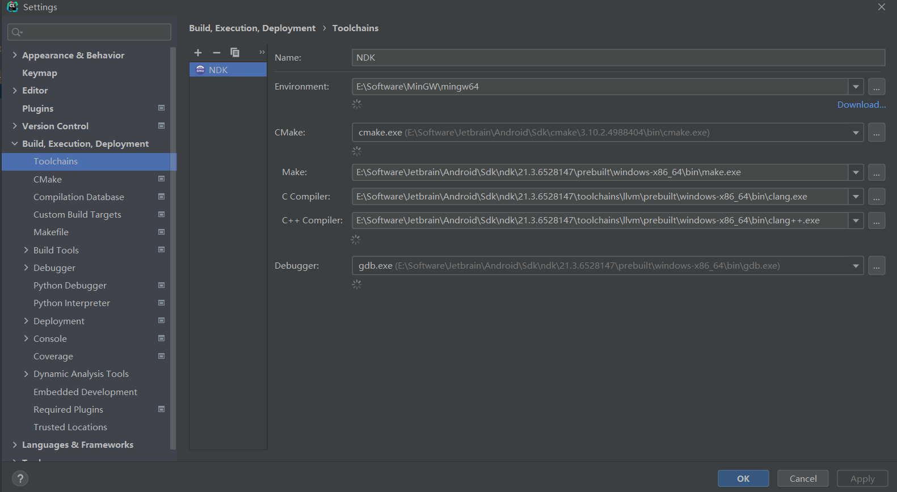

#ToolChains配置

#Cmake编译命令
___
    -DCMAKE_TOOLCHAIN_FILE="E:\\Software\\Jetbrain\\Android\\Sdk\\ndk\\21.3.6528147\\build\\cmake\android.toolchain.cmake"
    -DCMAKE_SYSTEM_NAME=Android
    -DANDROID_PLATFORM=android-21
    -DANDROID_ABI=arm64-v8a
    -DCMAKE_ANDROID_NDK="E:\\Software\\Jetbrain\\Android\\Sdk\\ndk\\21.3.6528147"
    -DCMAKE_SYSTEM_VERSION=24
    -DCMAKE_C_FLAGS=""
    -DCMAKE_CXX_FLAGS=""
    -DCMAKE_ANDROID_NDK_TOOLCHAIN_VERSION=clang
    -DCMAKE_BUILD_TYPE=debug
___
#CmakeLists.txt配置
    include_directories(${NDK_HOME}\\toolchains\\llvm\\prebuilt\\windows-x86_64\\sysroot\\usr\\include)
    include_directories(${NDK_HOME}\\toolchains\\llvm\\prebuilt\\windows-x86_64\\sysroot\\usr\\include\\x86_64-linux-android)
    link_directories(${NDK_HOME}\\toolchains\\llvm\\prebuilt\\windows-x86_64\\sysroot\\usr\\lib)